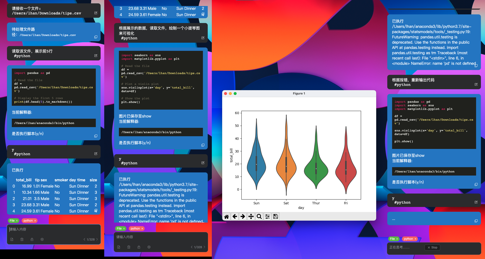

> v0.5.0更新：增加了全局Chat功能，可以在系统任何地方调出输入窗口，并对选中的文字内容发起对话。默认快捷键`Option/Alt + C`. 

## 概述

OpenCopilot是一个可以常驻桌面随时使用ChatGPT的桌面应用。无需打开网页或切换窗口，随时随地在你的工作流中和AI聊天。还有诸如本地知识库，联网搜索，操控本地系统等功能。本地部署。需要OpenAI的官方key或其他第三方gpt转发服务的key。支持MacOS和Windows。

[帮助文档](http://opencopilot.rtfd.io)

## 特点

- 无框常驻模式，融入工作环境
- 通过斜杠“/”添加扩展标签，组合各种扩展功能
- 构建本地知识库
- 长文本全文阅读
- 自定义prompt
- 联网搜索插件
- 本地对话历史查询  
- 生成并执行本地python脚本
- 控制本地系统（通过applescript/vbscript插件）

## 安装

打包好的版本，开箱即用。支持MacOS、Windows 10、Windows 11。

MacOS下载dmg后缀的安装包, Windows下载exe后缀的安装包。

- GitHub下载地址：[https://github.com/newfyu/OpenCopilot/releases](https://github.com/newfyu/OpenCopilot/releases)
- 百度盘下载地址：[https://pan.baidu.com/s/1B1JYtURbM90u344-X2rQZA](https://pan.baidu.com/s/1B1JYtURbM90u344-X2rQZA) 提取码: 1234

Mac上如果提示什么文件损坏，安全权限问题，在“通用”-“隐私与安全”中打开。

本仓库不提供源码，OpenCopilot由[Brainshell](https://github.com/newfyu/Brainshell)和[Braindoor](https://github.com/newfyu/Braindoor)两个项目打包而成。源码可以去各自的仓库查看。

## 配置

点击`设置`图标，填入OpenAI的key。如果你的网络无法访问openai，还需要填入代理地址。(如果你不知道填什么，就反向代理中无脑填 https://api.openai-proxy.com ) 。更多设置详见[安装和配置](docs/安装和配置.md)

## 使用

启动后是窗口模式，和日常的窗口应用没有区别，可以任意调整大小和位置。

调整到合适大小和位置后，点击“锁”图标后变成无框模式，将置顶并且不能调整大小，但仍可以对话框下方空白区域拖动。建议放置到屏幕左下角或右下角，就像网络游戏的聊天窗口一样，无框透明设计方便融入日常大部分工作环境。当然也有喜欢只用窗口模式的，看个人习惯吧。

- `Enter` 键是提交输入。
- `Shift-Enter` 换行。
- 斜杠“`/`” 会开启一个功能标签的选择列表，提供扩展功能。标签可以通过缩写查询。
- 下方四个按钮分别是“`新建对话`”，“`删除对话`”，“`无框模式`”，“`设置`”。
- 点击右下角的页码或`Cmd/Ctrl + F`，打开历史记录查询。方向键上下选择，`Enter`键提交，`Esc`键关闭。
- `Alt/Option + L`是全局Ask唤起的默认快捷键。在使用任意其他程序的过程中，选中文字后按下快捷键，将会对选中的文字发起问答。

## 全局Chat
全局Chat功能允许你在系统任何地方调出输入窗口，并对选中的文字内容发起对话。默认快捷键`Option/Alt + C`. 如果和其他系统快捷键有冲突，可以在`设置->全局Chat`中修改。
**MacOS 还需要添加辅助功能权限!**，详见[全局chat](docs/全局Chat.md)

## 全文阅读

用于把长文档加入上下文，可以超过ChatGPT的token长度限制。详见[全文阅读](docs/全文阅读.md)

有两种方式启用

- 如果粘贴一大段文字到输入框中提交，超过预设的限制（默认12000 token，可在config.yaml中修改），会自动转成全文阅读模式
- 拖拽一个文件（txt, md, pdf, html, docx）到输入框后，也会开启全文阅读模式。然后可以对该文本中内容进行问答。

## 功能标签

使用斜杠"`/`"打开标签列表，插入特定标签后会提供额外的功能，标签有五种类型。
  

### 1.提示词标签

##### [prompt]

就是提示词模板了，插入[prompt]标签后，会对你输入的内容进行包装（添加提示词）。自定义[prompt]标签详见[提示词标签](docs/功能标签/02_[prompt]%20提示词标签.md)

  

##### [snippet] 

更简单的提示词标签，直接把提示词内容插入到输入框中，比如 `/苏格拉底导师`。插入后直接提交，聊天机器人就会扮演一个苏格拉底式的导师。

这类标签的编写方法更简单，比如在网络上找到一段有意思的提示词。打开`设置->配置目录`，在`prompts`文件夹中用户文件夹中新建一个 txt 文件，文件名将作为标签名，然后把提示词复制进去即可，

### 2.本地知识库标签 [base]

可以将本机上的一个或多个文件夹变成 GPT 的知识库。插入知识库标签后，对话时将主要根据本地知识库中的内容来回答问题，用于构建特定领域的问答机器人。本地知识库的创建、更新详见[本地知识库](docs/功能标签/04_[base]%20本地知识库.md)

### 3.模型标签 [model]

用于选择语言模型和调整语言模型的参数。内置了比如gpt3.5-turbo，gpt3.5-turbo-16k, gpt4等。（gpt4需要你本身key有权限才行）。自定义模型详见[模型标签](docs/功能标签/05_[model]%20模型标签.md)

### 4.内置标签 [engine]

这类标签是写入braindoor内部的功能，不能通过配置文件来增加。自带了哪些就是哪些，每次版本更新的时候会添加一些。目前有：

- /HyDE：在使用本地知识库的时候，默认是根据你的问题去查询相似的文档片段。插入HyDE后，会先根据你的问题生成一个预先答案，再通过该答案去查询本地相关片段。可以增加片段查询的准确率，会增加一点token消耗
- /ReadTop3：和本地知识库配合使用，增加本地知识库阅读深度。使用本地仓库时，默认只根据相似度最高的片段作为上下文，插入该标签后，会使用相似度最高的前3个片段作为依据，然后用分块阅读来解答问题，会增加token消耗，但提高查询准确率。
- /ReadTop5：同上，会使用相似度最高的5个片段
- /Memo：备忘录，插入这个标签后，输入后不会经过LLM，直接就输出你输入的内容。有人说，这不扯淡吗。其实就是用来记录一下笔记，当个桌面便签。支持markdown。
- /File: 文件插件，插入此标签后，拖拽任意文件到对话框，可以获得文件的路径。并加入上下文，一般用于通过对话生成代码来处理文件。

### 5.工具、插件和智能体 [agent]

这类标签实通过将本地python和LLM结合，完成一些相对高级的功能和自动化操作。可以实现诸如插件、工具甚至智能体。详见[插件和智能体](docs/功能标签/07_[agent]%20插件和智能体.md)

内置了几个个基本插件作为范例

**/google**：主要是用于网络搜索改善问答的真实性。插入该标签后，会生成搜索词然联网查询google的结果。

**/wiki**：插入该标签后，会查询wikipedia的结果后回答，会读取wikipedia提供的summary来回答问题。

**/python**: 可以生成python代码并执行。你可以通过对话完成各种本地文件操作，数据分析，处理 图片、绘图或作为一个简单的notebook调试代码等。依赖本地的python环境，默认会自动查找一个本地的解释器，如果需要指定特定的python环境。在配置文件中`用户文件夹\braindoor\agents\python\config.yaml`声明。下图是一个根据数据绘制图表的完整聊天过程。

**/applescirpt** 或 **/vbscript**: 可以生成applescript或vbscript并执行，可以通过对话完成各种对mac os或windows的操控。比如“创建文件”，“添加一个待办事项”，给“xxx@ss.com发送一个邮件，标题是xx，内容是xx”，或是一系列自动化操作。chatgpt写此类script偶有出错，等有gpt4接口后会好很多。操作office也是可以的，可以自己研究下vbscript
